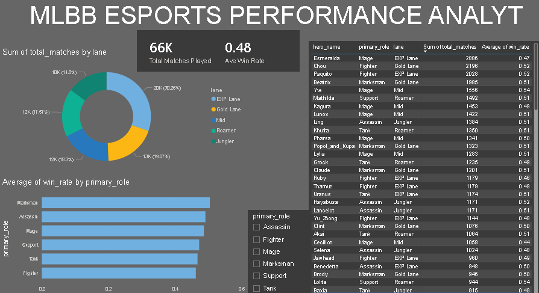

# Mobile Legends: Bang Bang (MLBB) Esports Performance Analytics Hub

An end-to-end data analytics project that structures raw competitive gaming data into a clean MySQL relational database and deploys a dynamic, dark-themed Power BI dashboard to analyze meta performance trends.

## 📊 Dashboard Preview

## 🚀 Key Project Highlights
* **Relational Database Design:** Built a functional star schema environment connecting granular match facts (`esports_performance_fact`) with hero specifications (`hero_stats_dim`).
* **Interactive UI/UX Modeling:** Engineered a premium dark-themed corporate dashboard using high-level summary cards, custom role slicers, and scrolling metric grids.
* **Aggregated Insights:** Modeled clean performance breakdowns across 114 heroes, map lanes, and primary competitive roles.

## 🛠️ Tech Stack & Tools Used
* **Database Management System:** MySQL Server & MySQL Workbench
* **Business Intelligence & Visualization:** Power BI Desktop
* **Data Integration:** MySQL Connector/NET Driver
* **Initial Data Preprocessing:** Python (Pandas)
